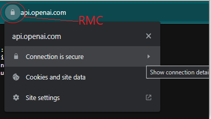
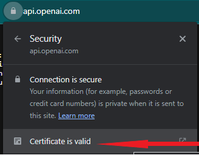
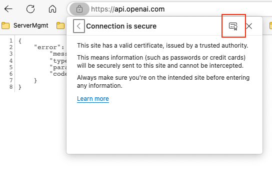
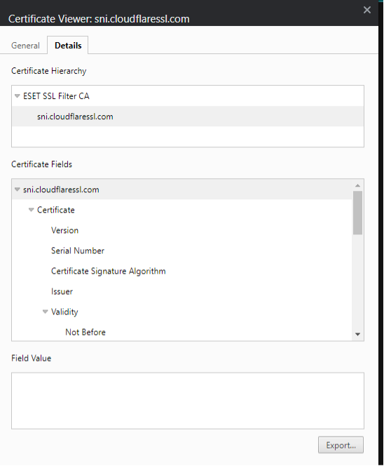
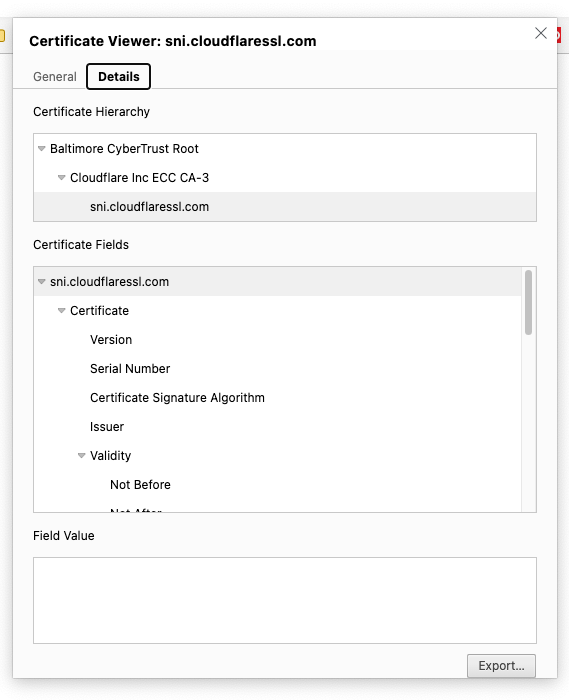
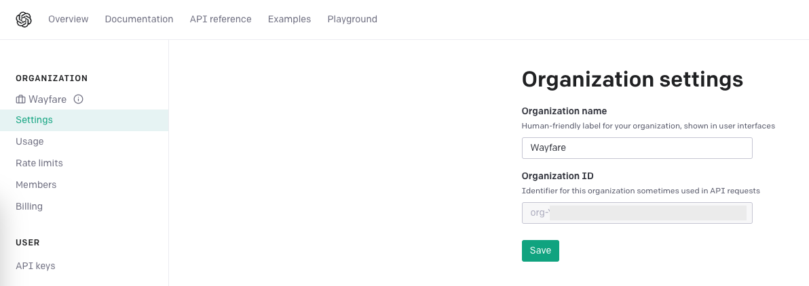
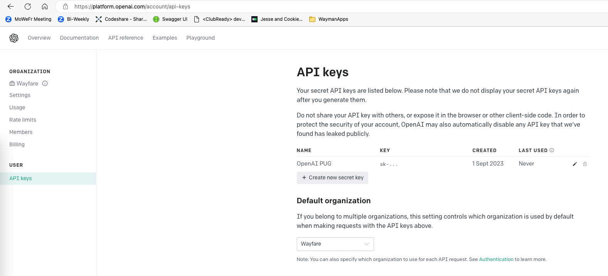
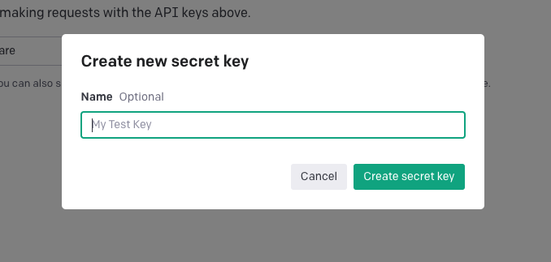
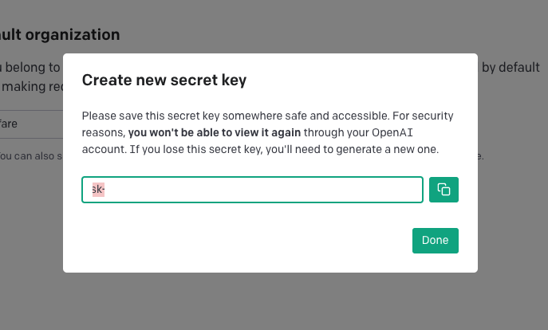

# Calling ChatGPT from OpenEdge

Hey there! In the ChatGPT Birds-of-a-Feather session at PUG Challenge 2023 we showcased how you can take advantage of ChatGPT
in the development of OpenEdge code.

In this document we show you how you can contact ChatGPT from OpenEdge. Also, in this folder you can find some sample code
developed to interact with ChatGPT.

## Prerequisites

In order to call the ChatGPT API from OpenEdge, and integrate ChatGPT into your application, you need some things to be installed
and configured.

First of all you will need OpenEdge 12.x installed and an OpenAI account. You can create a free account in the platform (https://platform.openai.com/).
You will get 5$ to use for your testing. Before starting the implementation, check the pricing page: [https://openai.com/pricing](https://openai.com/pricing).
Be aware that for each API request you make to the ChatGPT, the usage is computed based on how many words you are using (tokens).

Also, you need to install a series of certificates into the OpenEdge certificate store:

- Cloudflare SSL SNI
- Baltimore CyberTrust Root (https://aboutssl.org/digicert-trusted-root-authority-certificates/)

### Installing certificates

You can easily obtain the certificates, together with the Certificate Authority (CA) certificate from the OpenAI API website:

1. Go to https://api.openai.com
2. Right mouse click on the lock near the URL and open the "Connection is secure" submenu. 
 


3. From this submenu clock on the "Certificate is valid" button or the certificate button near the "X" button.





4. Go to the "Details" tab and export the certificate in "DER" format





After you downloaded the certificates, start a `proenv` session and import the certificates using the `certutil` command:

```bat
certutil -format DER -import "PATH_TO_CERT"
```

Example:

```bat
certutil -format DER -import "C:\Users\valentin\Downloads\cloudfare.der"
```

To test the connection use the following command (in `proenv`):

```bat
sslc s_client -connect api.openai.com:443 -servername api.openai.com -CApath c:\Progress\OpenEdge\certs\
```

## Calling OpenAI API

In order to call the OpenAI API you need to generate an [API Key](https://platform.openai.com/account/api-keys) and get
your [Organization ID](https://platform.openai.com/account/org-settings).

### Initial setup

To get the Organization ID go to this link: https://platform.openai.com/account/org-settings.
In this page you should see a disabled field named `Organization ID`. Copy the value from there
and add it to an Environment or Configuration Variable.



To generate an API Key, go to this link: https://platform.openai.com/account/api-keys. In this page
you should see a list with all your generated API keys.



To generate the API Key, click the button "Create new secret key". This will open a popup screen
where you can give your API Key a name.



After filling the name press the "Create secret key" button. A second popup screen will appear where
your API key is shown. Please copy the key show at this step somewhere safe. This is the only time
this key will be shown to you. If you lose this key, you need to generate a new one.
Now, add the same key in an Environment or Configuration variable to be able to use it.



Now you should be able to see information about your new key in the API Keys list page.


### Calling OpenAI from OpenEdge

The first call we should do is to fetch the list of available Models we can use:

```openedge
block-level on error undo, throw.

using OpenEdge.Net.HTTP.ClientBuilder from propath.
using OpenEdge.Net.HTTP.IHttpClient from propath.
using OpenEdge.Net.HTTP.IHttpClientLibrary from propath.
using OpenEdge.Net.HTTP.IHttpRequest from propath.
using OpenEdge.Net.HTTP.IHttpResponse from propath.
using OpenEdge.Net.HTTP.Lib.ClientLibraryBuilder from propath.
using OpenEdge.Net.HTTP.RequestBuilder from propath.
using Progress.Json.ObjectModel.JsonObject from propath.
using Progress.Lang.AppError from propath.
using Progress.Json.ObjectModel.JsonArray from propath.

define variable oJsonObject     as JsonObject           no-undo.
define variable oLib            as IHttpClientLibrary   no-undo.
define variable oHttpClient     as IHttpClient          no-undo.
define variable oRequestBuilder as RequestBuilder       no-undo.
define variable oRequest        as IHttpRequest         no-undo.
define variable oResponse       as IHttpResponse        no-undo.
define variable oEntity         as Progress.Lang.Object no-undo.
define variable cMessage        as character            no-undo.
define variable cApiKey         as character            no-undo.
define variable cOrganizationID as character            no-undo.

assign
    cApiKey         = "sk-***"
    cOrganizationID = "org-***".

oLib = ClientLibraryBuilder:Build():ServerNameIndicator("api.openai.com"):library.

oHttpClient = ClientBuilder:Build():UsingLibrary(oLib):Client.

assign
    oRequestBuilder = RequestBuilder:Get("https://api.openai.com/v1/models")
    oRequestBuilder = oRequestBuilder:AcceptContentType("application/json")
    oRequestBuilder = oRequestBuilder:ContentType("application/json")
    oRequestBuilder = oRequestBuilder:AddHeader("Authorization", substitute('Bearer &1', cApiKey))
    oRequestBuilder = oRequestBuilder:AddHeader("OpenAI-Organization", cOrganizationID).

oRequest = oRequestBuilder:REQUEST.

oResponse = oHttpClient:Execute(oRequest).

if valid-object(oResponse) and
    oResponse:StatusCode <> 200 then
do:
    cMessage = substitute("Http request returned error: &1, status code &2",
        quoter(oResponse:StatusReason),
        quoter(string(oResponse:StatusCode))
        ).
    undo, throw new AppError(cMessage, 0).
end.

oEntity = oResponse:Entity.

if oResponse:ContentType = "application/json" and
    valid-object (oEntity) then
    oJsonObject = cast(oEntity, JsonObject).

oJsonObject:WriteFile("response.json", yes).

finally:
    delete object oJsonObject       no-error.
    delete object oLib              no-error.
    delete object oHttpClient       no-error.
    delete object oRequestBuilder   no-error.
    delete object oRequest          no-error.
    delete object oResponse         no-error.
    delete object oEntity           no-error.
end finally.
```

We can interact with ChatGPT using the following code:

```openedge
block-level on error undo, throw.

using OpenEdge.Net.HTTP.ClientBuilder from propath.
using OpenEdge.Net.HTTP.IHttpClient from propath.
using OpenEdge.Net.HTTP.IHttpClientLibrary from propath.
using OpenEdge.Net.HTTP.IHttpRequest from propath.
using OpenEdge.Net.HTTP.IHttpResponse from propath.
using OpenEdge.Net.HTTP.Lib.ClientLibraryBuilder from propath.
using OpenEdge.Net.HTTP.RequestBuilder from propath.
using Progress.Json.ObjectModel.JsonObject from propath.
using Progress.Lang.AppError from propath.
using Progress.Json.ObjectModel.JsonArray from propath.

define variable oJsonObject     as JsonObject           no-undo.
define variable oJsonArray      as JsonArray            no-undo.
define variable oLib            as IHttpClientLibrary   no-undo.
define variable oHttpClient     as IHttpClient          no-undo.
define variable oRequestBuilder as RequestBuilder       no-undo.
define variable oRequest        as IHttpRequest         no-undo.
define variable oResponse       as IHttpResponse        no-undo.
define variable oEntity         as Progress.Lang.Object no-undo.
define variable cMessage        as character            no-undo.
define variable cApiKey         as character            no-undo.
define variable cOrganizationID as character            no-undo.

assign
    cApiKey         = "sk-***"
    cOrganizationID = "org-***".

oJsonObject = new JsonObject().
oJsonObject:Add("role", "user").
oJsonObject:Add("content", "Say this is a test!").

oJsonArray = new JsonArray().
oJsonArray:Add(oJsonObject).

oJsonObject = new JsonObject().
oJsonObject:Add("model", "gpt-3.5-turbo").
oJsonObject:add("messages", oJsonArray).
oJsonObject:Add("temperature", 0.7).

oLib = ClientLibraryBuilder:Build():ServerNameIndicator("api.openai.com"):library.

oHttpClient = ClientBuilder:Build():UsingLibrary(oLib):Client.

assign
    oRequestBuilder = RequestBuilder:Post('https://api.openai.com/v1/chat/completions', oJsonObject)
    oRequestBuilder = oRequestBuilder:AcceptContentType("application/json")
    oRequestBuilder = oRequestBuilder:ContentType("application/json")
    oRequestBuilder = oRequestBuilder:AddHeader("Authorization", substitute('Bearer &1', cApiKey))
    oRequestBuilder = oRequestBuilder:AddHeader("OpenAI-Organization", cOrganizationID).

oRequest = oRequestBuilder:REQUEST.

oResponse = oHttpClient:Execute(oRequest).

if valid-object(oResponse) and
    oResponse:StatusCode <> 200 then
do:
    cMessage = substitute("Http request returned error: &1, status code &2",
        quoter(oResponse:StatusReason),
        quoter(string(oResponse:StatusCode))
        ).
    undo, throw new AppError(cMessage, 0).
end.

oEntity = oResponse:Entity.

delete object oJsonObject no-error.

if oResponse:ContentType = "application/json" and
    valid-object (oEntity) then
    oJsonObject = cast(oEntity, JsonObject).

oJsonObject:WriteFile("response.json", yes).

finally:
    delete object oJsonObject       no-error.
    delete object oLib              no-error.
    delete object oHttpClient       no-error.
    delete object oRequestBuilder   no-error.
    delete object oRequest          no-error.
    delete object oResponse         no-error.
    delete object oEntity           no-error.
end finally.

```

